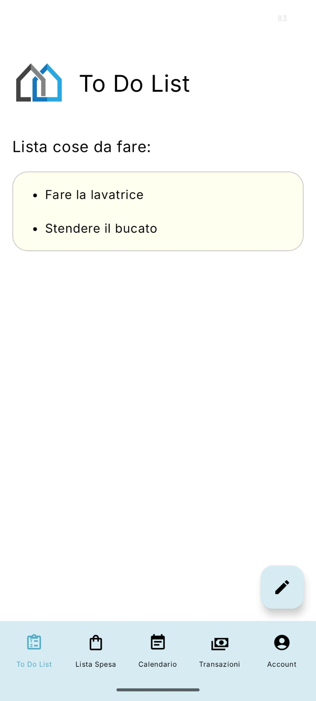
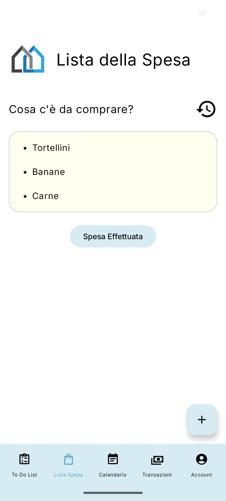
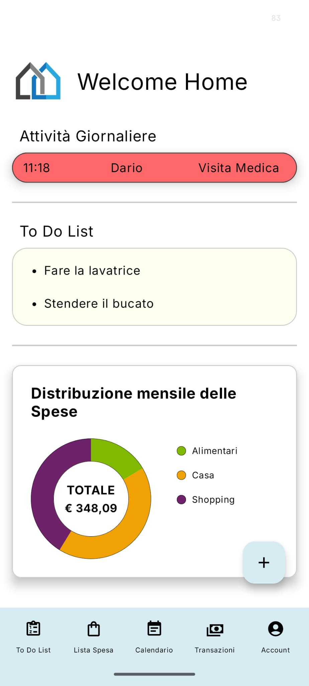

Family-Hub è un'app Android per la gestione collaborativa della vita familiare: attività condivise, liste della spesa, transazioni fra membri, promemoria e tracking della posizione. Il progetto è scritto in Kotlin e può integrare Firebase.

**Caratteristiche principali**
- Gestione della famiglia (crea/entra in una famiglia, gestisci membri)
- To‑Do & Attività condivise
- Liste della spesa collaborative
- Tracciamento transazioni e storico
- Notifiche pianificate e worker (vedi `app/src/main/java/Notifiche/Worker.kt`)
- Servizio foreground per posizione (vedi `app/src/main/java/Posizione/LocationForegroundService.kt`)

**Download APK**
L'APK per test o installazione manuale è incluso nel repository:

- Scarica l'APK: [Family-Hub.apk](Family-Hub.apk)

**Screenshot**

	
<strong>Home</strong>: schermata iniziale con accesso alle funzioni principali dell'app.

	

  

	
<strong>ToDo</strong>: sezione dedicata alla gestione delle attività condivise.

	

  

	
<strong>Lista della spesa</strong>: schermata per creare e consultare la lista della spesa condivisa.

	

  

	
<strong>Spese</strong>: area dedicata alla visualizzazione e gestione delle spese/transazioni.

	

